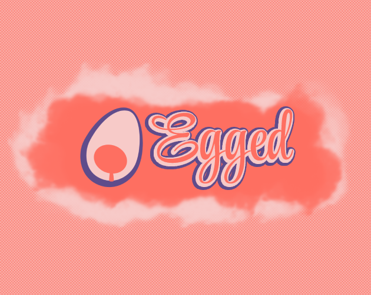

# Egged

This is the source code of my first released game, made for the Four Color Art Jam 2023.

You can download it in the browser [here](https://aarcangeli.itch.io/egged)

## Screenshots

## Sound Attributions
This game uses these sounds from freesound:
- "glass brake", "glass 3.wav" by max2587 ( https://freesound.org/people/max2587/ ) licensed under Attribution 4.0
- "Getting hit hugh" by nioczkus ( https://freesound.org/people/dersuperanton/ ) licensed under Attribution 3.0
- "Arrow.wav" by nioczkus ( https://freesound.org/people/EverHeat/ ) licensed under Attribution 3.0
- "dry shock" by JuanFG ( https://freesound.org/people/JuanFG/ ) licensed under Attribution 4.0
- "Door, Front, Opening, A.wav" by InspectorJ  ( https://freesound.org/people/InspectorJ/ ) licensed under Attribution 4.0
